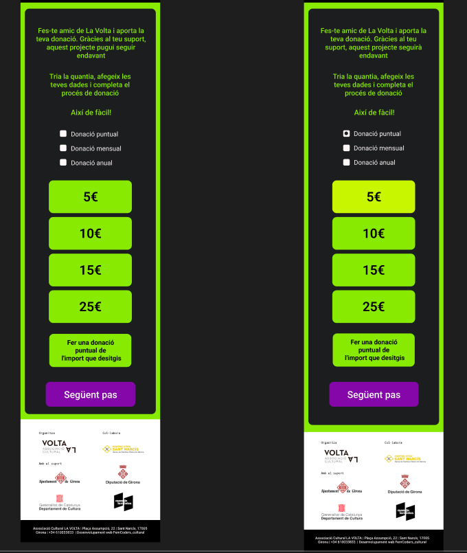

### Información General :ledger:
***
La Asociación cultural La Volta ofrece diferentes modalidades de socio para que artistas, artesanos, gestores y creadores desarrollen su proyecto profesional de autoempleo a través del ecosistema de La Volta.
La acción de La Volta gira en torno a los residentes y los proyectos de creación que materializarán a lo largo de la residencia de dos años, prorrogable a través de otras categorías de socios, para acompañar el proceso creativo y potenciar la retroalimentación con otros creadores, públicos o entidades.
***
**Nuestro objetivo es ampliar su sistema de socias/os para recibir contribuciones económicas y ofrecerles beneficios por su aporte a partir de la web que estamos creando. La Volta ya tiene su propia web en WordPress.**
***
Este diseño hace parte del proyecto final del bottcamps ***Femcoders*** de [Factoria F5](https://factoriaf5.org/) :woman_student:

### Screenshot



## Tecnologias
***
Metodologias y herramientas: :toolbox:
* [Trello](https://trello.com/b/Ls3plE0O/kanban-la-volta) 
* [Visual Studio](https://code.visualstudio.com/)
* [GitHub](https://github.com/La-Volta/la-volta-client/edit/main/README.md)
* [Laravel](https://laravel.com/): versión 5.5
* [Php](https://www.php.net/manual/es/intro-whatis.php): versión 8.0
* [MySQL](https://www.mysql.com/): versión 8.0.29 
* [Stripe](https://stripe.com/es)
* [Figama](https://www.figma.com/file/uxSfTva6l0hcZhLCf5MgES/La-Volta?node-id=1-15)
## Instalación
***
1. Clonar el proyecto 
```
https://github.com/La-Volta/la-volta-api.git
```
2. Ir al directorio del proyecto
```
cd la-volata-api
```
3. Instalar dependencias
```
  npm install
```
```
  composer install
```
4. Activar el servidor y mantener este terminal abierto
```
 npm run dev
``` 
5. Ejecute el servidor PHP y mantenga este terminal abierto
  ```
  php artisan serve
  ```
6. Migrar base de datos
```
  php artisan migrate:fresh --seed
```

***Enlace para el repositorio del [cliente](https://github.com/La-Volta/la-volta-client)***

## Miembros del equipo
***
* [Maricarmen](https://github.com/marchuovi) :penguin:
* [Amelie](https://github.com/AmelieLT) :hatched_chick:
* [Juliana](https://github.com/JulianaMZa) :flamingo:
* [Bianca](https://github.com/bgiudicid) :parrot:
* [Luisa](https://github.com/LuisaVAZ) :owl:
